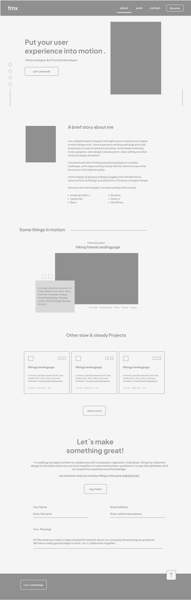
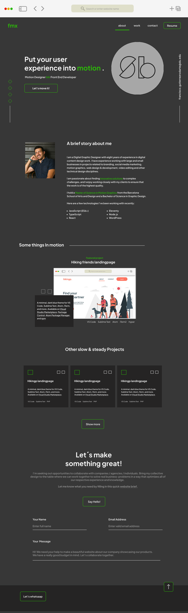

# Professional Portfolio

## Description

Is my first web developing portfolio to connect with potential clients and just to share with the world my future projects from the Coding Bootcamp at University of Denver.

My goal is to especialize more into the web animations and interactions to make the web apps and website more attractive.

I learn a lot of CSS while building this portfolio and Im feeling really proud of the results. Some developed skills during this challenge: flexbox, media queries, and CSS variables.

## Acceptance Criteria

```
GIVEN I need to sample a potential employee's previous work
WHEN I load their portfolio
THEN I am presented with the developer's name, a recent photo or avatar, and links to sections about them, their work, and how to contact them
WHEN I click one of the links in the navigation
THEN the UI scrolls to the corresponding section
WHEN I click on the link to the section about their work
THEN the UI scrolls to a section with titled images of the developer's applications
WHEN I am presented with the developer's first application
THEN that application's image should be larger in size than the others
WHEN I click on the images of the applications
THEN I am taken to that deployed application
WHEN I resize the page or view the site on various screens and devices
THEN I am presented with a responsive layout that adapts to my viewport
```

## Wireframe

Here is the my first wireframe created in figma.



## Hi-Fi Wireframe

Here is the my High fidelity wireframe created also in figma.



## Deployed site link
https://franciscogtzrodarte.github.io/portfolio-francisco-rodarte/

# Thank your for watching
